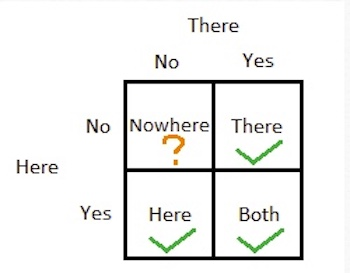
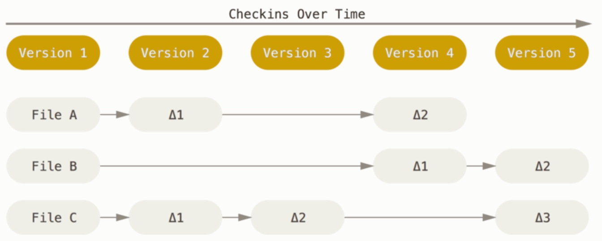
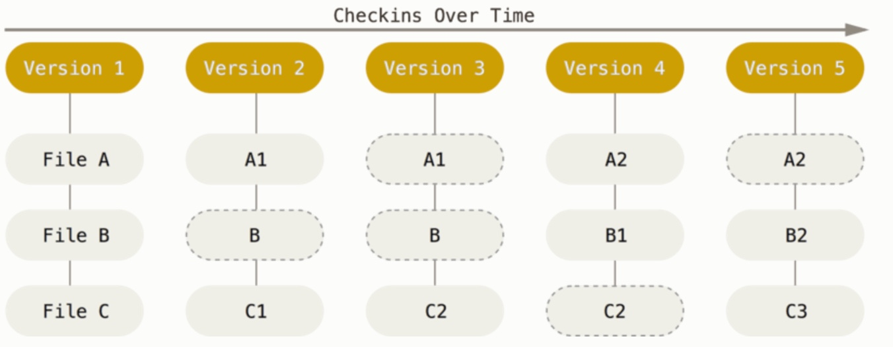
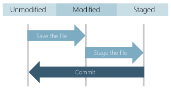
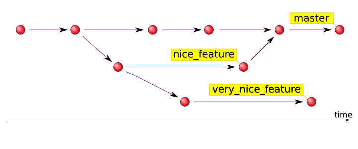

include::../_settings_deck.adoc[]
// include::../../_settings_reveal.adoc[]

= Git and GitHub

== Why Version Controlling?

//* Backups of a project at different states,

* Backing of our project at different states, like
** after we solve a bug?
** before trying out a new feature?
* Working on a team, how
** do we manage which copy is the __central__ version if each developer works in its own?
** can we allow for more than one developer to work in the same file?
**  can we track what changes have been done by each developer?

== Version Control Systems (VCS)

* A complete long-term change history of every file 
** Creation, edition and deletion of files

* Revert files to previous states
* Revert entire projects back to previous states
* Compare changes over time
* Branching and mergin
** Individuals working on independent streams of changes
** Enables to verify that the changes on each branch do not conflict
* Traceability
** Trace each change made to the software by each contributor
** Connect it to project management and bug tracking software such https://www.web.com[JIRA].

== Different flavors:

* Non-Existing
* Local(here)
* Centralized(there) like for example CVS or Subversion (also known as SVN)
* Distributed(both) like Git or Mercurial 

//In summary a Version Control System allows you to easily recover //former working states if you screw things up or lose files.

== Diffs VS Snapshots

== What is Git?

* By far, the most widely used modern version control system in the world.
* Is a mature, actively maintained open source project originally developed in 2005 by https://www.wikipedia.com/linux[Linus Torvalds](Linux operating system kernel).

* An example of a DVCS:
** Everything is local
** Is really fast
** Snapshots, not diffs
** Distributed not centralized

//https://git-scm.com/book/en/v2/Getting-Started-Git-Basics

== Installing Git

* **Windows**: https://git-scm.com/download/win[https://git-scm.com/download/win]
* **Mac**: https://git-scm.com/download/mac[https://git-scm.com/download/mac]

Then we check the installation by checking git's version: 

`$ git --version`

Possible outputs:

* `git version 2.10.1`
* `bash: git: command not found`

== Configuring Git:

- Our **identity**, so every time we make a commit, it is associated to our person:

[source, bash]
----
$ git config --global user.name "your name"
$ git config --global user.email your.email@propulsion.ch
----
- The **editor** to be used if git wants to show us something:

[source, bash]
----
git config --global core.editor <vim, emacs, subl, atom....>
git config --global core.editor "subl -n -w"
git config --global core.editor "atom --wait" 
----
- Enable **color** in git, so the outputs will be easier to read:

[source, bash]
----
git config --global color.ui auto
----
- Check all the settings:

[source, bash]
----
git config --list
----
  
== Git workflow

In a Git repository a file can be in one of these three states:

* Modified: When you modify files in your working directory
* Staged: You stage the files, adding a snapshot of them to the staging area
* Commited: You do a commit that stores snapshots permanently to your GIt directory

== Git basic operations (I)

* To create a new Git project:
** `git init`
** `git clone /path/to/repo`

* See state of the repository:
** `git status`

* Add new files to staging area:
** `git add <filename>`
** `git add *`

* Commit changes:
** `git commit -m "Commit message"`

== Git basic operations (II)

* To see the history of a repo:
** `git log`
** `git log -n <number>`
** `git log --stat`
** `git log --pretty=oneline`

* See changes in a commit:
** `git show <commitID>`

* or compare two commits:
** `git diff commit1ID commit2ID`

* Revert to previous state:
** `git checkout <commitID>`
* or return to current state:
** `git checkout master`

== Example I: Basic commands in Git

1. Create a new repository
2. Add some files
3. Stage them
4. Modify one file
5. Check state of the repo
6. Commit changes
7. Repeat the process for other files
8. Go back to a previous state.
9. Inspect the directory
** Which files were added by git?

== Branchhing
Branches are used to develop features isolated from each other:

* The **master** branch is the "default" branch when you create a repository.

* We use other branches for development and merge them back to the master branch upon completition.

== Operations

* To list all branches:
** `git branch`

* To create a new branch:
** `git branch <new_branch_name>`

* To switch to a different branch:
** `git checkout <other_branch_name>`

* To create and swith to a new branch:
** `git checkout -b <new_branch_name>`

* To delete a branch:
** `git branch -d <branch_name>`

* To merge branches into the master:
** `git checkout master`
** `git merge <branch_a>`

== Problems with branches

Sometimes auto-merge is not possible and the result are *conflicts*. 

* Master and another branch modify the same file.

So we are responsible to merge those conflicts manually by editing the files shown by git. 

* Editor of choice.
* **Tip**: Before mergin changes, preview changes.
** `git diff`

== EXAMPLE II: Branching in Git

* Create a new branch
* Create a new file in this branch
** Add some content
** Commit it
* Navigate between branches and see the state of both from your text editor
* Generate a conflict by modifying the same file in both branches
* Merge branch into master

== Working with remote repositories

* A remote URL is Git's fancy way of saying "the place where your code is stored." 
* That URL is going to be our repository on GitHub, but it could be another user's fork, or even on a completely different server.
* Two types of URL addresses:
**   An HTTPS URL like ``https://github.com/user/repo.git``
**   An SSH URL, like ``git@github.com:user/repo.git``

Git associates a remote URL with a name, and your default remote is usually called `origin`.

== Origin

* By convention the name it recives the new remote repository(GitHub).
* It could be multimple remote repositories.

When cloning a repository for the first time:

* It is the default name given to the original remote repository that you clone. It is where you want to pull and push changes.

== Operations

* To add a remote:
** `git remote add origin https://github.com/yhabib/gitTest.git`

* To send local changes from master to the remote:
** `git push -u origin master`

* or from a particular branch:
** `git push origin <branch_name>`

* To fetch remote changes:
** `git pull`

* For a remote branch we first need to check it:

** `git fetch`
** `git checkout <branch_name>`

== Markdown

* Adding `readme.md` files in a repository makes them look more profesional
* Markup lenguage used by GitHub
* Very easy to learn and use
* https://github.com/adam-p/markdown-here/wiki/Markdown-Cheatsheet[Cheatsheet]

== EXERCISE III: Advance Git

* Create a new repository in GitHub
* Push your local repo to this remote
* Push as well branches
* Create a readme.md
** With title and a list of elements
* Check all the information that GitHub offers about the repository

== Exercise IV: Working on a team

1. Each member in the team should have a GitHub account.
2. A GitHub repository has to be created by a member of the group.
3. Inside the repository:
** Settings
** Collaborators
** Add collaborators
4. Rest in the groud should copy the repository's url and clone into their respective computers.
5. Start to create ;)

== Personal recommendation

* How to organize Propulsion Academy code
** Projects based
** Course based
* GitPages, easy way to create a web page for you or your page
** https://mapageka21.github.io/[Personal Page]
** https://yhabib.github.io/JavaScript30/[Project Page]
* GitHub daily contributions
** Important for job searching
* https://code.visualstudio.com/[Visual Studio Code]

